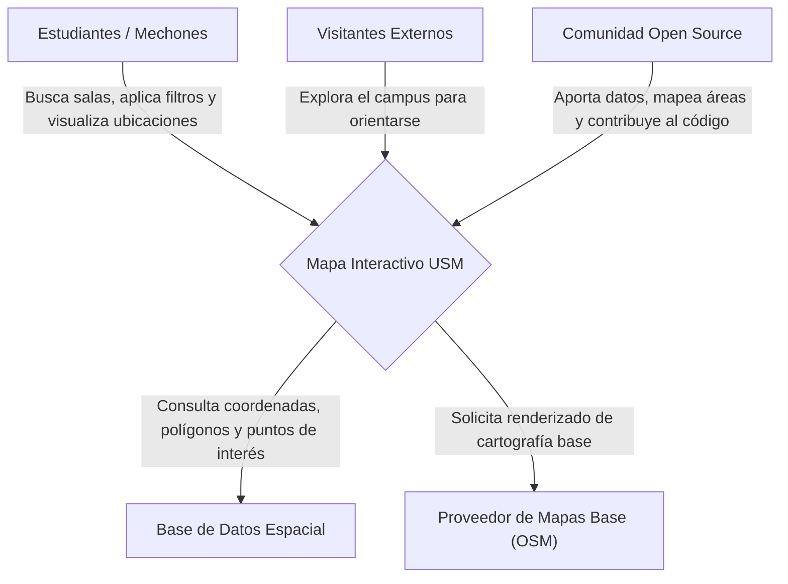

# RFC: Mapa Interactivo de la USM

## 1. Contexto y Visión
* **Problema Actual:** Actualmente no existe una opción centralizada e interactiva de un mapa de la universidad, teniendo que recurrir a mapas en PDF estáticos que no clarifican la ubicación de puntos clave del campus, como laboratorios, puntos de recarga de agua o departamentos.
* **Objetivo General:** Crear una plataforma web que sintetice todo este contenido geográfico de una manera interactiva, con información clasificada en distintas categorías (nombre de edificios, departamentos, baños, puntos de recarga de agua, entre otros).
* **Objetivos Específicos:**
    * Digitalizar y categorizar mediante polígonos y coordenadas los puntos de interés principales del campus en capas de datos estructuradas.
    * Implementar una interfaz de usuario con controles de filtros interactivos para mostrar u ocultar categorías específicas.
    * Proveer una herramienta de consulta rápida que reduzca el tiempo que los estudiantes de primer año invierten en ubicar sus salas y servicios básicos.
    * Mantener el proyecto bajo una filosofía de código abierto (OSS) para fomentar la colaboración comunitaria.
* **Métrica de Éxito:** Alcanzar una métrica de más de 100 usuarios activos en la plataforma por mes.
* **Imagen a Proyectar:** Debe ser una herramienta rápida, intuitiva y pensada principalmente para utilizarse desde un dispositivo móvil.

## 2. Requisitos y Alcance (Definiendo el MVP)
* **Usuarios Finales / Interesados:** Principalmente estudiantes de primer año (mechones), pero útil para toda la comunidad sansana y visitantes externos que no conocen la distribución del campus.
* **Requisitos Funcionales (Indispensable / Ahora):**
  * El sistema **debe** mostrar un mapa interactivo base, con opciones de zoom y paneo, **para** que el usuario pueda explorar el campus y sus alrededores libremente.
  * El sistema **debe** permitir filtrar puntos de interés por categorías (Departamentos/Edificios, Salas de Estudio, Auditorios, Laboratorios, Bibliotecas, Tiendas/Comida, Deportes, Agua, Baños, Puntos Limpios, Sector de Fumadores, Descanso, Cultura) **para** facilitar la visualización de necesidades específicas.
  * El sistema **debe** incluir una barra de búsqueda **para** que el estudiante encuentre edificios o salas específicas por su sigla o nombre rápidamente.
  * El sistema **debe** mostrar una tarjeta de información al hacer clic en un marcador **para** entregar contexto adicional, tal como nombre, departamento, piso y foto referencial.
  * El sistema **debe** ser responsivo y estar optimizado para pantallas táctiles **para** garantizar su máxima usabilidad en dispositivos móviles.
* **Lujo / Futuro (Después del MVP):**
  * Trazado de rutas para calcular el camino más corto entre un edificio y otro, considerando escaleras y accesibilidad.
  * Selector de pisos/niveles para mostrar el interior de edificios complejos.
  * Geolocalización en tiempo real usando el GPS del dispositivo del usuario.
  * Seccion de comentarios y sistema de valoraciones para distintos espacios de la universidad.
* **Fuera de Alcance (¿Qué NO es el proyecto?):**
  * La plataforma no es un sistema de reserva de salas, espacios deportivos o laboratorios.
  * El sistema no requerirá inicio de sesión ni cuentas de usuario para la visualización o comentarios.

## 3. Diseño Técnico y Arquitectura

* **Diagrama de Contexto:**

* **Stack e Infraestructura:**
    * **Frontend:** Next.js con Tailwind CSS.
    * **Visualización de Mapas:** MapLibre GL JS o Leaflet para renderizar las capas geográficas.
    * **Base de Datos:** PostgreSQL con la extensión **PostGIS** para el almacenamiento y consulta eficiente de datos geográficos (polígonos y coordenadas).
    * **Cartografía:** QGIS para la digitalización de áreas verdes y puntos no presentes en OSM; Maputnik para el estilizado de los vectores.
    * **Licencia Sugerida:** MIT.
* **Requisitos No Funcionales:**
    * **Rendimiento:** El mapa base y las capas principales deben cargar en menos de 2 segundos en redes móviles.
    * **Mantenibilidad:** El código debe estar documentado en el repositorio de GitHub de la organización para facilitar contribuciones de otros estudiantes.
